# FastAPI with Docker example

## Assignment 1:

Demonstrate minimum 15 basic docker command with explanation and screenshot.

    1.“docker –version” 
To check the docker installation and its version
 
 

    2.“docker images”
This command is used to check available images in the system.
 
  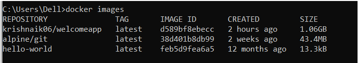

    3.“docker pull <image_name>”
This command is used to pull docker image from docker hub to local
 
  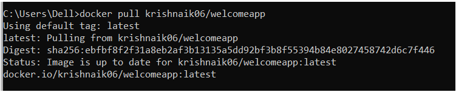

    4.“docker run <detached mode> <port configuration>  <if any other configuration required> <image_name>”
This command is used to run the docker images/container
 
  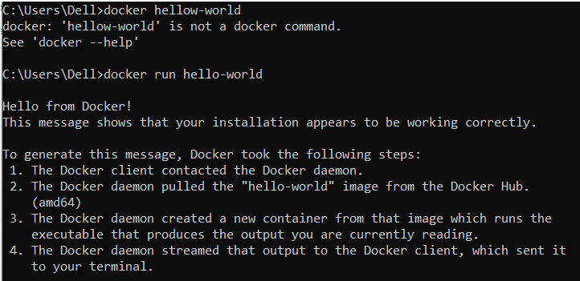

    5.“docker ps”
This command is used to check running docker images/ containers
 
 

    6.“docker stop <container_id>”
This command is used to stop the docker running image
 
  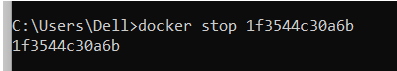

    7.“docker” kill <container_id>
This command is used to kill docker running container abruptly 
 
 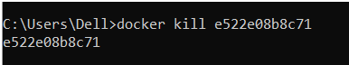

    8.“docker rmi -f <image_name>”
This command used to remove running container
 
 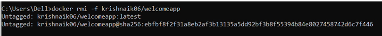

    9.“docker logs <container_id> -f”
This command used to tails the logs 
 
  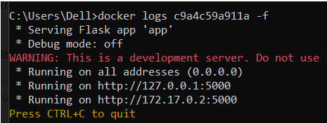

    10.“docker rename <container_id> <app_name>”
This command used to rename the container name.
 
  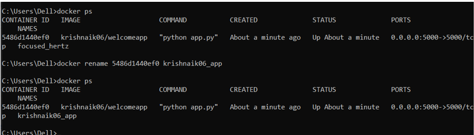

    11.“docker build -t <username>/<image_name> .”
This command used to build the docker image by using docker file

 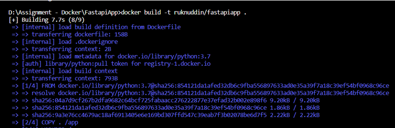

    12.“docker push <username>/<image_name>:<tagname>”
This command is used to push your local image to your docker hub repository

  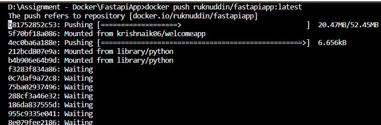

    13.“docker history <image_name>”
This command is used to get history of images in details. 
 
  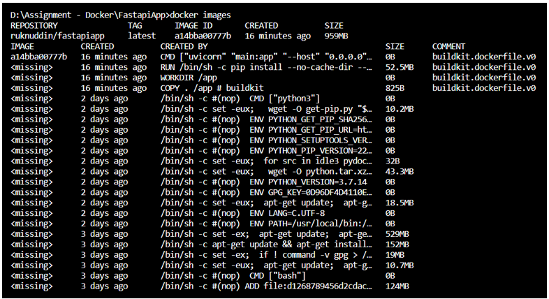

    14.“docker login”
This command is used to login docker hub from terminal
 
  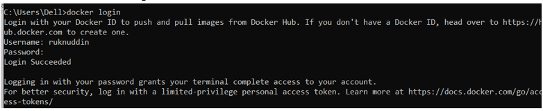

    15.“docker attach <container_id>”
This command is used to get into another running container. In below screenshot logged into centos container from root docker container. 
Mainly used when user/developer want to changes default configuration of the container or to install any dependencies.
We need commit it once required changes are done using “docker commit <updated container id>/<container name> <new container name>”
  
 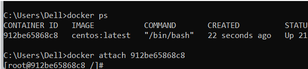
    
## Assignment 2:

Hello World Docker Image Run Hello World Docker Image Locally.

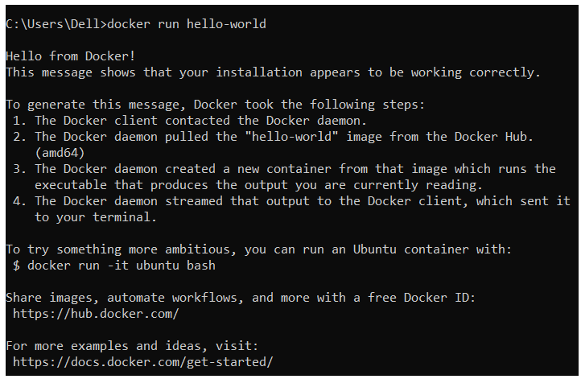

## Assignment 3:

Create a hello world fastapi application. Create a Dockerfile for your fastapi hello world application. Build Docker image using Docker file. Run docker image build in previous step. Push your Docker image to Docker Hub.

1. Source code: “https://github.com/ruknuddinmohd/fastApiwithDocker.git”
2. Docker image name: “ruknuddin/fastapiapp” 

3. Docker hup repo:
    
    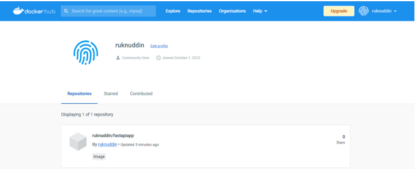

4. Output:
    
    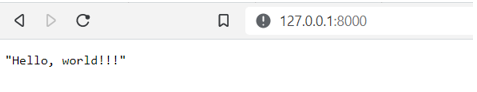

## Assignment 4:

Automate Assignment below task using github action.

i.Build Docker Image  
ii.Push Docker Image to Docker hub.

1. Action status:
    
    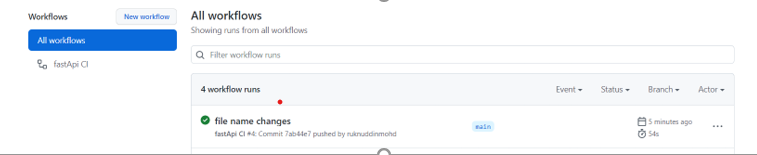

2. Github action workflow:
    
    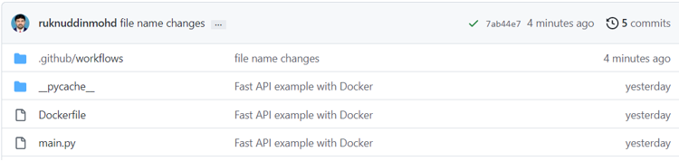

3. Docker Hub screenshot:
    
    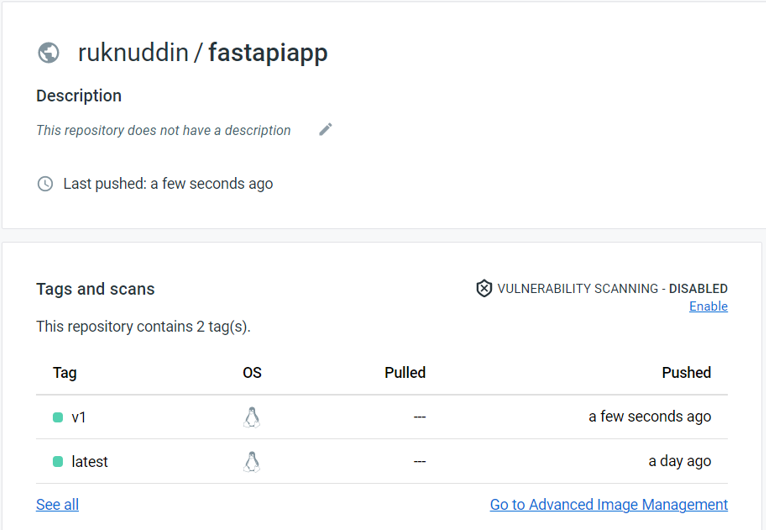

## Tech Stack

**Stack:** Python, FastAPI,  Docker, GitHub

## 🚀 About Me
- Enthusiastic Learners...!!!

## 🔗 Links

## Support

For support, email ruknuddinmohd@gmail.com or join our Slack channel.

